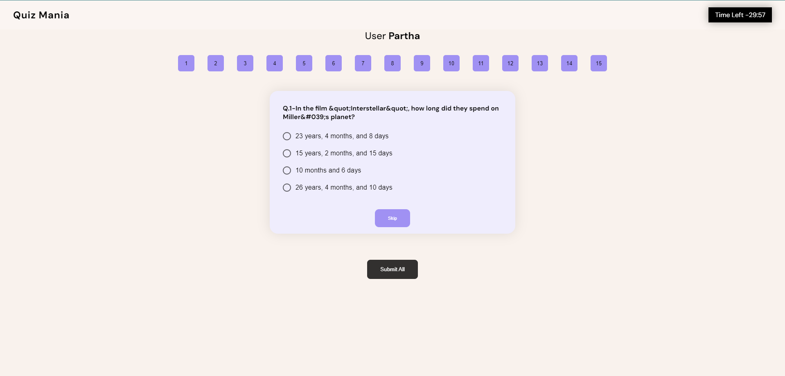

# QUIZ MANIA
### A simple quiz app where you will get 15 questions once and 30 minutes to submit. Also The web app is completely responsive.
<br>

## Contributors

- [Partha](https://www.github.com/partha7978)
<br><br>

## Screenshots

### Big Screen ( > 900px )

| Popup Page | Question Page | Result Page |
| :---: | :---: | :---: |
|  |  |  |

<br>

### Small Screen ( < 600px )

| Popup Page | Question Page | Result Page |
| :---: | :---: | :---: |
|  |  |  |

<br>


## Installation

Install world affairs on your local machine

```bash
  git clone https://github.com/partha7978/quizApp.git

  cd world-affairs
```

### After installing on your local machine, you have to install all the packages that are used in this project.

```bash
  npm install
``` 

### To run this project on your local machine

```bash
  npm start
```

## Tech Stack

* HTML
* CSS
* JavaScript
* React
* Material UI
* Quiz Api
* React Icons
* React Router
* Redux Toolkit
* Framer Motion


### Open Points

* On the question page, user should be able to see the status of the question [answered, unanswered, visited]. 
* Store data in local storage. Retrive the previous data in case user reloads. 


### Contributions are welcome. Please open an issue or a pull request on  [GitHub](https://github.com/partha7978/quizApp.git)

<br> 

## Copyright (c) 2022 <a href="https://parthadev.netlify.app/" target="_self">Partha Sarathi Muduli</a>